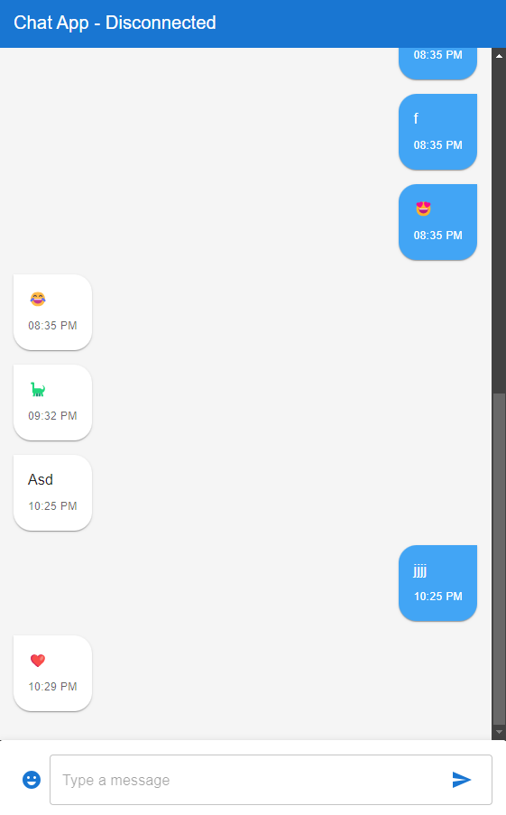

# Real-time Messaging App

This is a basic real-time messaging app built using React, Next.js, TypeScript, Material-UI, and Socket.io. It allows users to connect, send, and receive messages and emojis in real-time.
[]


## Features

- Real-time messaging using Socket.io
- Emojis support
- Responsive UI with Material-UI components
- Built with React, Next.js, and TypeScript for a modern development stack

## Prerequisites

Make sure you have the following installed on your machine:

- Node.js (version 20 or higher)
- npm or yarn

## Getting Started

### Clone the repository

```bash
git clone https://github.com/CCHaynes112/Chat2.git
cd chat2
```

### Install dependencies

Using npm:

```bash
npm install
```

Using yarn:

```bash
yarn install
```

### Running the development server

To start the development server, use the following command:

```bash
npm run dev
```

or with yarn:

```bash
yarn dev
```

Open [http://localhost:3000](http://localhost:3000) to view the app in your browser. The page will reload as you make edits.
